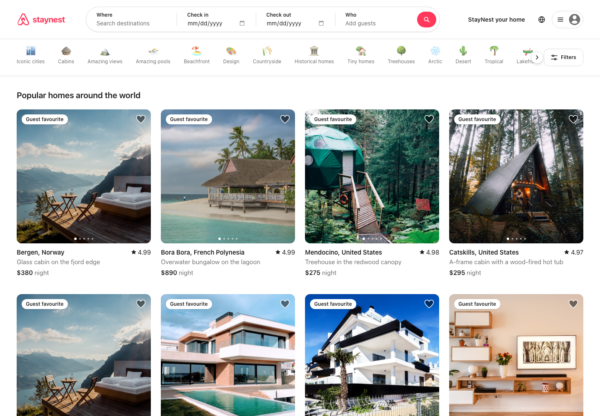

# StayNest

An Airbnb-style vacation rental marketplace — React + Tailwind on the front,
Supabase (Postgres, auth, RLS, Edge Functions) on the back, Stripe Checkout for payments.



## Stack

| Layer | Choice |
| --- | --- |
| UI | React 19 + TypeScript, Tailwind CSS v4, React Router, TanStack Query |
| Backend | Supabase — Postgres with row-level security on every table |
| Auth | Supabase Auth (email + password) |
| Payments | Stripe Checkout via two Supabase Edge Functions |
| Tests | Playwright (UI flows + a direct RLS probe against the REST API) |
| Photography | Unsplash |

## Getting started

```bash
npm install
cp .env.example .env   # fill in the Supabase and Stripe values
npm run dev
```

## Environment

| Variable | Where it lives | Purpose |
| --- | --- | --- |
| `VITE_SUPABASE_URL` | `.env` | Project API URL |
| `VITE_SUPABASE_PUBLISHABLE_KEY` | `.env` | Publishable (anon) key |
| `VITE_STRIPE_PUBLISHABLE_KEY` | `.env` | Stripe test publishable key |
| `STRIPE_SECRET_KEY` | Supabase Edge Function secret | Server-side Stripe calls |
| `STRIPE_WEBHOOK_SECRET` | Supabase Edge Function secret | Verifies webhook signatures |

The secret keys are never exposed to the browser — they only exist as Edge Function secrets.

## Database

Seven tables, all with RLS enabled:

- `profiles` — created automatically by a trigger on `auth.users`
- `listings` — public read, host-only write
- `bookings` — a guest sees only their own; hosts see bookings on their listings;
  only the service role (the Stripe webhook) may set `confirmed`.
  A GiST exclusion constraint makes overlapping confirmed stays impossible.
- `wishlists` / `wishlist_items` — private to the owner
- `reviews` — public read, author-only write

Two `SECURITY DEFINER` helpers expose availability without leaking booking rows:
`is_listing_available(listing, check_in, check_out)` and `listing_booked_ranges(listing)`.

## Payments

`create-checkout-session` recomputes the price and re-checks availability from the
database, so a tampered client cannot change what it is charged. It writes a
`pending` booking and returns a Stripe Checkout URL. `stripe-webhook` verifies the
Stripe signature and flips the booking to `confirmed` (or `cancelled` on expiry).

## Tests

```bash
npx playwright test
```

Covers browsing, search, category filtering, price arithmetic, sign-in, wishlist
persistence across reloads, and RLS isolation between users.

## Demo account

`guest@staynest.dev` / `staynest-demo-2026`
